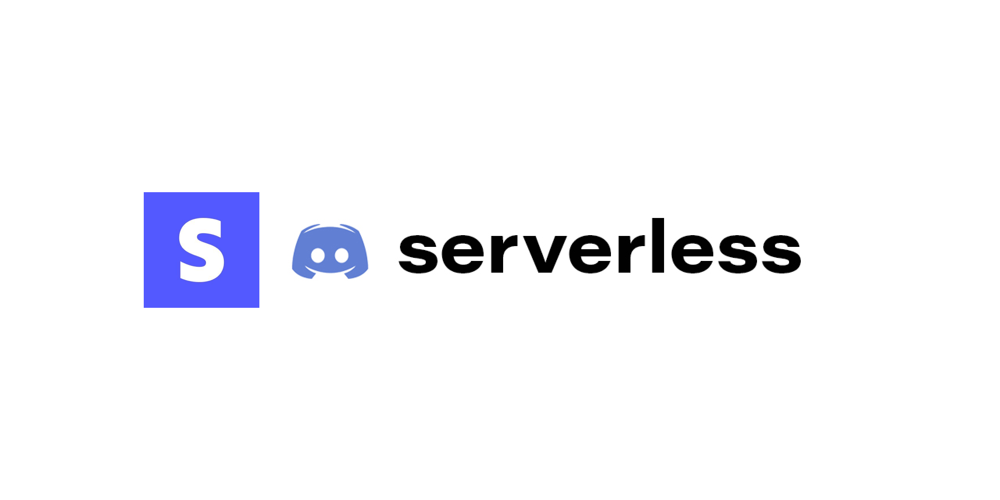

<h3 align="center">Get stripe's events forwarded to Discord webhooks through Vercel serverless functions.</h3>

### Installation

Please visit [sds.cryo.wtf](https://sds.cryo.wtf) which documents the setup. In short, we form a URL that contains the Discord webhook ID and Token, and use that as our stripe URL. That way we can use the body with ID and Token in a stateless environment.

### Credits

This project is heavily inspired by https://github.com/alii/linear-discord-serverless